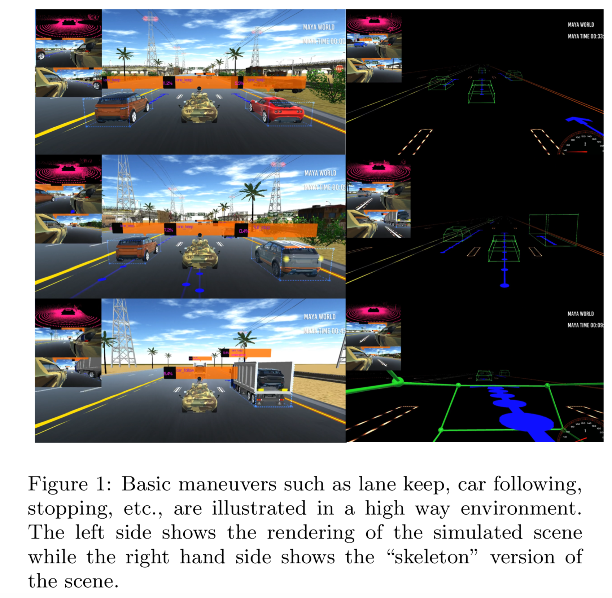
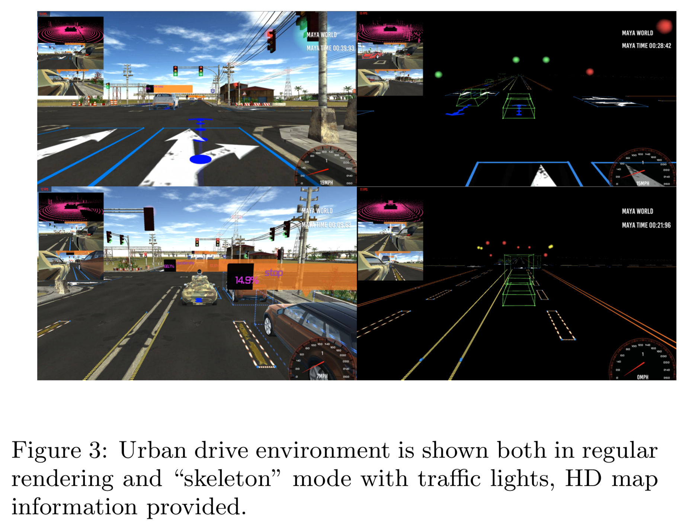

# Maya
This repo contains the maya, a 3D simulation environment, which is dedicated for autonomous
driving vehicle applications. The simulator can be used for testing and training planning,
prediction, and reinforcement learning algorithms.

Examples of reading vehicle data, LIDAR point clouds, image data, HD map data, as well as sending
control commands to the vehicles are also provided in this repo.

Author: Dr. Z. Xing\
Date: Feb 2018

## Setup on your local machine
### run maya in standalone mode
- Install Nanomsg
  - Linux\
  ``sudo cp artifacts/libnanomsg.so.5.1.0 /usr/local/lib/libnanomsg.so``\
  - Mac\
  ``sudo cp artifacts/libnanomsg.5.1.0.dylib /usr/local/lib/libnanomsg.so``\
  You might also need this for dlopen ``sudo ln -s /usr/lib/libdl.dylib /usr/local/lib/libdl.so``\
  - Both Linux and Mac\
  ``sudo cp -rf artifacts/nanomsg /usr/local/include/nanomsg``\
- Download simulator from AWS s3 buckets, free public access\
for MAC, download .app (GUI mode)\
``aws s3 cp --recursive s3://athena-robotics-maya/car_race.app ./car_race.app``\
for Linux, download .x86_64 (GUI and batch mode) and the data folder\
``aws s3 cp s3://athena-robotics-maya/car_race_gui.x86_64 ./car_race_gui.x86_64``\
``aws s3 cp --recursive s3://athena-robotics-maya/car_race_gui_Data ./car_race_gui_Data``
- For Mac build, you might need to add permissions +x after downloading from AWS S3\
``car_race.app/Contents/MacOS/car_race``
- For Linux build, you might need to add permissions +x after downloading from AWS S3\
``car_race_gui.x86_64``

### run maya with some unit-test of data logging and control commands
- ``conda env create -f environment.yml``
- ``source activate maya_public``
- ``pip uninstall nanomsg``
- ``pip install --global-option=build_ext --global-option="-I/usr/local/include/nanomsg/" nanomsg``
- compile the protocol buffer \
``python -m grpc_tools.protoc -I./protos/ --python_out=. --grpc_python_out=. ./protos/message.proto``
- Sending control commands and log vehicle data\
``python test_maya.py --maya_path ./car_race_gui.x86_64``
- Log lidar point cloud \
``python test_maya.py --maya_path ./car_race_gui.x86_64 --dump_lidar``
- Log HD map \
``python test_maya.py --maya_path ./car_race_gui.x86_64 --dump_hd_map``
- Log image data\
``python test_maya.py --maya_path ./car_race_gui.x86_64 --dump_png``

## Setup using Docker
- pull the docker image from Docker Hub\
``docker pull joexingai/maya``
- Launch the container for unit-test, for example \
``docker run -it joexingai/maya /bin/bash -c \
"source activate maya_public && chmod +x car_race.x86_64 && python test_maya.py \
--batch_mode --maya_path ./car_race.x86_64"``

## Future content

We will provide various collision traffic scenes with a standard scoring system to measure the
performance of engaged planning algorithm, collision avoidance, etc.

## Example of scenes: high way, urban scenes

## Example a proto buffer message of vehicle data

timestamp: "190"\
driver_name: "my_ego_vehicle"\
vehicle_name: "Lotus Sport"\
road_segment_name: "test_street_1_5"\
car_center {\
  x: 124.71600341796875\
  y: -0.3257102966308594\
  z: -566.065185546875\
}\
car_bounding_box {\
  center {\
    x: 124.6864013671875\
    y: -0.17793969810009003\
    z: 566.1279296875\
  }\
  bottom_left_rear {\
    x: 123.12640380859375\
    y: -1.153825044631958\
    z: 569.0092163085938\
  }\
  bottom_right_rear {\
    x: 126.25959777832031\
    y: -1.153988003730774\
    z: 569.0092163085938\
  }\
  bottom_right_front {\
    x: 126.25959777832031\
    y: -1.1581259965896606\
    z: 562.9171142578125\
  }\
  bottom_left_front {\
    x: 123.12640380859375\
    y: -1.1579630374908447\
    z: 562.9171142578125\
  }\
  top_left_rear {\
    x: 123.12650299072266\
    y: 0.5646607875823975\
    z: 569.0081176757812\
  }\
  top_right_rear {\
    x: 126.25969696044922\
    y: 0.564497709274292\
    z: 569.0081176757812\
  }\
  top_right_front {\
    x: 126.25969696044922\
    y: 0.5603601932525635\
    z: 562.916015625\
  }\
  top_left_front {\
    x: 123.12650299072266\
    y: 0.560523271560669\
    z: 562.916015625\
  }\
}\
car_tire {\
  right_front_tire_angle: 0.0\
  left_front_tire_angle: 0.0\
  right_rear_tire_angle: 0.0\
  left_rear_tire_angle: 0.0\
}\
car_velocity {\
  vx: 0.00044476939365267754\
  vy: 0.41675129532814026\
  vz: 0.0021763069089502096\
}\
motor_input: 0.0\
brake_input: 0.0\
steer_input: 0.0\
hand_brake_input: 0.0\
left_light: 0\
right_light: 0\
traffic_lights {\
  list_of_traffic_light {\
    color: "Red light"\
  }\
  list_of_traffic_light {\
    color: "Green light"\
  }\
  list_of_traffic_light {\
    color: "Red light"\
  }\
  list_of_traffic_light {\
    color: "Green light"\
  }\
}\
traffic_light_stop_points {\
  list_of_traffic_light_stop_points {\
    center {\
      x: 124.54750061035156\
      y: -1.6800010204315186\
      z: 498.75140380859375\
    }\
  }\
  list_of_traffic_light_stop_points {\
    center {\
      x: 129.6374969482422\
      y: -1.7000019550323486\
      z: 498.7113952636719\
    }\
  }\
  list_of_traffic_light_stop_points {\
    center {\
      x: 107.49749755859375\
      y: -1.6799999475479126\
      z: 487.7713928222656\
    }\
  }\
  list_of_traffic_light_stop_points {\
    center {\
      x: 107.50749969482422\
      y: -1.7000010013580322\
      z: 492.87139892578125\
    }\
  }\
  list_of_traffic_light_stop_points {\
    center {\
      x: 118.9574966430664\
      y: -1.6999980211257935\
      z: 471.2214050292969\
    }\
  }\
  list_of_traffic_light_stop_points {\
    center {\
      x: 113.82749938964844\
      y: -1.7199989557266235\
      z: 471.2914123535156\
    }\
  }\
  list_of_traffic_light_stop_points {\
    center {\
      x: 136.1475067138672\
      y: -1.7000000476837158\
      z: 482.2914123535156\
    }\
  }\
  list_of_traffic_light_stop_points {\
    center {\
      x: 136.1074981689453\
      y: -1.7199989557266235\
      z: 477.2013854980469\
    }\
  }\
}

